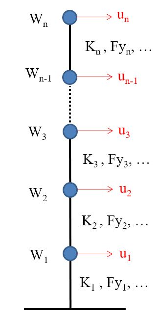

# 目录
* [多自由度系统非线性时程分析：NASM](#多自由度系统的时间历史分析：NASM)
* [简化模型](#简化模型)
    * 本构模型输入
    * 结构模型输入
    * 地震动输入
	* GUI界面输入
* [输出](#输出)
* [其他信息](#其他信息) 
* [参考文献](#参考文献)
# 多自由度系统的非线性时程分析：NASM
NASM 是用于执行多自由度（MDOF）系统的非线性时间时程分析的非商业性Matlab GUI。求解算法是Newmark常加速度法[1]，EHHT法[2]、KR-α[3]、中心差分法（CDM）[4]，FFAST[5],Gui-λ[6]、SEE-α[7]法，采用Newton-Raphson迭代（Chopra第4版，表16.3.3）进行求解。
# 简化模型
## 本构模型输入
本构模型可以有三种方式可供选择：线弹性模型，双线性模型，三线性模型，可以包括P-$\Delta$效应。模型的本构关系如图1-3所示。  

 
   

 
   

 
   

## 结构模型输入
NASM 使用MDOF系统的剪切集中质量模型，其质量集中在端点（我们常说的糖葫芦串模型）。  
用户通过.csv文件输入模型信息。  
用户可以通过示例文件Model.csv进行模拟输入。   

  

## 地震动输入
用户通过.csv文件输入要分析的地面运动记录及其比例因子。提供了此文件的示例以供参考。每个地面运动的名称在第一行，第二行输入计算的点数，第三行的时间步长（$\Delta t$），第四行的比例因子和加速时间序列（以[g为单位] ]）是从第五行到结尾。  
如果第四行中指定的点数大于时间系列中的加速点数，则在记录末尾填充零以匹配指定的点数。例如，这对于正确估计残余变形特别有用。另一方面，如果第四行中指定的点数低于时间序列中的加速点数，则修改记录以匹配指定的点数。  
NASM为用户提供两种选择：  
1.按指定的比例因子分析每个地面运动；  
2.缩放每个地面运动以获得导致崩溃的比例因子（在此选项中，忽略输入文件中指定的比例因子）。  
## GUI界面输入
NASM需要用户输入：  
1.BuildingInformation 选取结构信息文件.csv；  
2.Ground Motions 选择地震动信息文件.csv；  
3.选取本构模型信息：包括linear、bilinear、trilinear三种本构模型，可以考虑P-Δ 效应；  
4.选取合适的分析方法：AAM、CDM、EHHT、FFAST、MK-α、Gui-λ、SEE-α法，一共七种方法，接下来会更新更多的新方法，请期待后续......  
5.选取振型阻尼比，阻尼采用瑞雷阻尼，请用户选取合适的振型及对应的阻尼比。  
# 输出
 - 可视化输出
 NASM 提供了几种响应的可视化。它还能够在给定的地面运动下产生结构响应（Dis-time，ResForce-Dis）的视频。
 - 数据输出
 用户可以从NASM导出不同的输出：
	* 每个地面运动中每个楼层的位移，层间位移，层间位移比（IDR），残余层间位移，Residual IDR，绝对速度，层间速度，总加速度和层间恢复力的最大值和最小值数据
	* 绝对位移、层间位移、IDR和层间恢复力的时程数据
	* 导致崩溃的比例因子
	* 每种方法计算的时间。
所有的计算结果均以.xlsx文件导出。
# 其他信息
NASM的开发在一定程度上参考了[THAMDOF](https://github.com/pheresi/THAMDOF)，在此基础上添加了新的算法，新的功能和新的界面。
MATLAB版本采用MATLABR2018B教育版。

# 第二次更新

为NASM程序添加了启动页面，运行NASM.m文件即可进行进入界面。欢迎各位提建议和对图标以及启动界面进行设计。

# 独立应用版本

standalone 版本在进一步更新中，敬请期待。
# 参考文献
[1]:NEWMARK N M. A method of computation for structural dynamics[J]. Journal of th engineering mechanics division, 1959, 85(3): 67–69  

[2]:本人基于HHT方法开发的一种新的双显示积分算法  

[3]:KOLAY C, RICLES J M. Development of a family of unconditionally stable explicit direc integration algorithms with controllable numerical energy dissipation[J]. Earthquak Engineering & Structural Dynamics, 2014, 43(9): 1361–1380.  

[4]:Subbaraj K, Dokainish M. A survey of direct time-integration methods in computationa structural dynamics—II. Implicit methods. Computers & Structures, 1989, 32(6):1387–1401.  

[5]:Zheng M, Yuan Z, Tong Q, et al. A novel unconditionally stable explicit integration metho for finite element method. The Visual Computer, 2018, 34(5):721–733.  

[6]:桂耀. 一族双显式算法及其在实时耦联动力试验中的应用[Doctor Thesis]. 2014.  

[7]:Kolay C. Parametrically dissipative explicit direct integration algorithms for computationa and experimental structural dynamics. 2016.    

****
|Author|郭豪鑫|
|---|---|
|E-mail|guohaoxin@hotmail.com|
****

 
